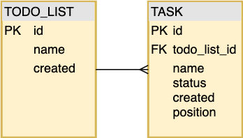
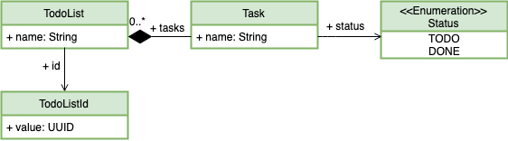

# Kotlin sql libs comparison

## Description

The idea of this project is to compare and see advantages and disadvantages of different SQL libs when they are used
 with kotlin with a simple problem as a context.

The problem to model is the typical `TodoList`, where you have a TODO list and it is composed with multiple tasks.

Here we have the **DB model** that we are going to use in the whole project.

<p align="center">
  
</p>

And this is the **domain** that we are going to use:

<p align="center">
  
</p>

DB model and domain are not the same, they diverge.

The [domain](./src/main/kotlin/com/alo/sqllibscomparison/domain/TodoList.kt) in kotlin is pretty simple:
```kotlin
data class TodoList(val id: TodoListId, val name: String, val tasks: List<Task>)

inline class TodoListId(val value: UUID)

data class Task(val name: String, val status: Status)

enum class Status { TODO, DONE }
```

With this simple problem we will tackle different problems that you always face when you are have to integrate with a
 SQL library like, how easy is to use, SQL generation, model mapping, maintainability, testability ... 

The idea is to have different implementations of the same repository in kotlin to access to this aggregate root
 with two different libraries:
* [Jooq](https://www.jooq.org/)
* [Exposed](https://github.com/JetBrains/Exposed)
* Feel free to add your favourite framework here. 

### Challenge

To see how flexible these libs are, let's imagine some use-cases that will force the implementations to handle not
 just simple queries:
 
* Since we will always access to an aggregate root, all queries will imply **one-to-many** joins; it means dealing with
 multiple rows and grouping, not just simple mappings from a row to a dto. 
* Find all not completed todo lists : Sub-querying
* Search and paginate todo lists: Conditional and dynamic querying

To make it easy and consistent, implementations should implement [interfaces](./src/main/kotlin/com/alo/sqllibscomparison/domain/boundary/):
```kotlin
interface TodoListFinder {
    fun listAll() : List<TodoList>
    fun search(searchBy: SearchBy? = null, pagination: Pagination? = null) : List<TodoList>
    fun findNotCompleted(): List<TodoList>
    fun get(id: TodoListId): TodoList?
}

data class SearchBy(val name: String)
data class Pagination(val start:Int = 0, val limit:Int=20)
```
 
## DSL vs ORM

Almost all SQL libraries offer an ORM version. We are not going to use the any of the libraries as an [ORM](https://en.wikipedia.org/wiki/Object-relational_mapping), **We want to use and love SQL**. 

Personal opinion about ORMs after being working with them many years:  "_I think ORMs are an anti-pattern and if you
 don't use them carefully your code will be prone to errors, bad design and bad performance._".
 
Why I consider ORMs an anti-pattern:
- SQL and OOP are different, they are simply different worlds, the first is about joins and the seconds about
 relationships.
- ORMs are not a real SQL abstractions: You want to get away from SQL but at the same time you have to be aware of what
 are they doing under the hood.
- They are not simple at all, they come with code generation and magic, your code will become dirty and tricky when
 you have to do complex queries (80% of projects)
- Loose totally the control of the generated SQL:
    - Prone to performance errors
    - Mysterious SQL code generation
    - Death by a thousand queries
- Database specific features or complex SQL features are not usually covered by ORMs
- Too easy to couple your domain to your database model
- The last reason, and maybe the most important one, with a good separation of concerns and following hexagonal
, onion or clean architectures, the code related to DB, should belong to infrastructure layer, so why would you want
 get rid of SQL in the implementation layer?

So, my question would be, why you want to use an ORM with all the risks listed above?

But, to be honest, JDBC directly is a bit painful:
- We don't want to write SQL directly:
    - We don't want to write SQL as strings.
    - Avoid dynamic queries generation with plain SQL   
    - Update strings is not scalable and maintainable at all.
- We don't want to deal with jdbc ResultSets, we want an easy way to map our results back to the domain, and again, if
 they could have some type of type safety it would also be great.
 
### Approach
**In a nutshell, our approach would like to use the frameworks as a :**
- Lightweight layer on top of of jdbc
- DSL, it means writing code that is similar to SQL syntax to access the DB, we love SQL but we want some help and
 type safety at compile time :) 
- Domain mapping facilitators
- Database first, we want to know what SQL we are generating!

### Project Stack

* Language: Kotlin
* Build tool: Gradle
* DB: PostgreSQL
* Test:
    * TestContainers
    * JUnit5
    * AssertK

## Project Structure
```bash
|-- main
|   |-- java
|   |   `-- com
|   |       `-- alo
|   |           `-- sqllibscomparison
|   |               `-- infrastructure
|   |                   `-- jooq
|   |                       `-- generated
|   |                           |-- *.java // JOOQ DB MAPPINGS (AUTO GENERATED CODE)
|   |-- kotlin
|      `-- com
|          `-- alo
|              `-- sqllibscomparison
|                  |-- domain
|                  |   |-- TodoList.kt // DOMAIN
|                  |   `-- boundary
|                  |       `-- TodoListFinder.kt // CONTRACTS
|                  `-- infrastructure
|                      `-- persistence
|                          |-- exposed
|                          |   |-- DatabaseMappings.kt  // EXPOSED DB MAPPINGS
|                          |   |-- TodoListDomainMapper.kt // TRANSLATIONS FROM EXPOSED RESULTS TO OUR DOMAIN 
|                          |   `-- TodoListRepository.kt  // EXPOSED TODO-LIST REPO
|                          `-- jooq
|                              |-- TodoListDomainMapper.kt // TRANSLATIONS FROM JOOQ RESULTS TO OUR DOMAIN  
|                              `-- TodoListRepository.kt  // JOOQ TODO-LIST REPO 
`-- test
    |-- kotlin
       `-- com
           `-- alo
               `-- sqllibscomparison
                   `-- infrastructure
                       `-- persistence
                           |-- *.kt // main test classes
                           |-- exposed
                           |   `-- TodoListRepositoryTest.kt // Exposed tests
                           `-- jooq
                               |-- CodeGen.kt // JOOQ code generator main
                               `-- TodoListRepositoryTest.kt // JOOQ tests

```
## Developing

### Running

All the project is based on tests, so to run it just:

```shell script
./gradlew test
``` 
### Collaborating
If you want to add your fancy SQL lib.
1. Add your impl to: 
[`/src/main/kotlin/com/alo/sqllibscomparison/infrastructure/persistence`](/src/main/kotlin/com/alo/sqllibscomparison/infrastructure/persistence)
2. Implement the interfaces declared in:
[`/src/main/kotlin/com/alo/sqllibscomparison/domain/boundary`](/src/main/kotlin/com/alo/sqllibscomparison/domain/boundary)
3. Add your test (there is no need to implement test, just extend this class):
[`/src/test/kotlin/com/alo/sqllibscomparison/infrastructure/persistence/TodoListFinderTest.kt`](/src/test/kotlin/com/alo/sqllibscomparison/infrastructure/persistence/TodoListFinderTest.kt)
4. Enrich this readme with your thoughts/findings
5. Create a PR


## Libs Comparison

### Database mapping

#### Exposed

In Exposed we don't work with raw SQL strings. Instead, we map tables, columns, keys, relationships, etc
... using a high-level DSL. The DSL (Domain Specific Language) API of Exposed, is similar to actual SQL statements with type safety that Kotlin offers. 
We will need to [mimic](./src/main/kotlin/com/alo/sqllibscomparison/infrastructure/persistence/exposed/DatabaseMappings.kt) our DB in our code to use the DSL afterwards:
```kotlin
enum class TaskStatus { TODO, DONE }

object Tasks : Table("TASK") {
    val id = uuid("id").primaryKey()
    val name = text("name")
    val todoListId = (uuid("todo_list_id") references TodoLists.id)
    val status = enumerationByName("status", 10, TaskStatus::class)
    val position = integer("position")
}

object TodoLists : Table("TODO_LIST") {
    val id = uuid("id").primaryKey()
    val name = text("name")
    val created = date("created")
    val updated = date("updated")
}
```
The API provided by Exposed is easy to use, allowing to map our DB pretty straight forward, just mapping tables
 directly. 

*Note:* Exposed is not mapping the database automatically, so we will need to do the changes manually when we change
 the DB, if not the code will be not consistent.

#### Jooq

There are many ways to work with jooq, but in our case we use the code generation. jOOQ's code generator takes your
 database schema and reverse-engineers it into a set of Java classes modelling tables, records, sequences, POJOs
 , DAOs, stored procedures, user-defined types and many more.

There are several maven and gradle plugins to generate the code integrated with the project lifecycle, but in our
 case we will use programmatic generator configuration, just do in it by ourselves.
 [CodeGen](./src/main/kotlin/com/alo/sqllibscomparison/infrastructure/persistence/jooq/CodeGen.kt)
 
 To regenerate all the mappings (we have to add extra code in gradle to run it):
 ```shell script
./gradlew JooqCodeGen
```

 The generated code is in java, not kotlin, and as you can see it reflects exactly all the database schema, it maps
  everything from tables to records, even indexes:
[Java generated code](./src/main/java/com/alo/sqllibscomparison/infrastructure/jooq/generated) 

*Note*: Now all the mappings are auto-generated by Jooq, but they are generated in java and we have to add extra code in
 our build lifecycle.
 
### DSL

#### Exposed
The DSL (Domain Specific Language) API of Exposed, is similar to actual SQL statements with type safety that Kotlin offers.
For example, listing all todo-list, in plain sql:
```postgresql
SELECT todo_list.id, todo_list."name", todo_list.created, todo_list.updated, task.id, task."name", task.todo_list_id, task.status, task."position" 
FROM todo_list 
LEFT JOIN task ON todo_list.id = task.todo_list_id 
ORDER BY todo_list.created DESC
```
With exposed this query get translated to:
```kotlin
TodoLists
    .leftJoin(Tasks)
    .selectAll()
    .orderBy(TodoLists.created, SortOrder.DESC)
```
Just with [schema mappings](./src/main/kotlin/com/alo/sqllibscomparison/infrastructure/persistence/exposed/DatabaseMappings.kt) we can use a simple and powerful API to easily access to our data.
 
#### Jooq
SQL building is the main feature of jOOQ, after run the code generator we could use Jooq API to in many ways to query
 our data.
Again, listing all todo-list, in plain sql:
```postgresql
SELECT todo_list.id, todo_list."name", todo_list.created, todo_list.updated, task.id, task."name", task.todo_list_id, task.status, task."position" 
FROM todo_list 
LEFT JOIN task ON todo_list.id = task.todo_list_id 
ORDER BY todo_list.created DESC
```
With Jooq this query get translated to:
```kotlin
 jooq.select()
    .from(TODO_LIST)
    .leftJoin(TASK)
    .on(TASK.TODO_LIST_ID.eq(TODO_LIST.ID))
    .orderBy(TODO_LIST.CREATED.desc())
```
The Jooq API is extremely powerful, with a lot of methods available to do complex queries, take a look on [their docs](https://www.jooq.org/doc/3.12/manual/sql-building/), they are huge with infinite options.

*Note*:Since Jooq is built in java, we can use it, but we can not use all the power of kotlin on it, like named params.

### Mapping back results: Type safety

#### Exposed
Queries in Exposed return `Query` objects that inherit Iterable<`ResultRow`>, we can see it as a map keyed by column.
So, after a query we would have to map the resulting single or multiple `ResultRow` to our domain:

In our case we only need to define two maps with two simple extension functions:
From `ResultRow` to `TodoList`:
```kotlin
private fun ResultRow.toTodoList() = TodoList(
        id = TodoListId(this[TodoLists.id]),
        name = this[TodoLists.name],
        tasks = emptyList()
    )
```
And from `ResultRow` to `Task`:
```kotlin
private fun ResultRow.toTask() = Task(
    name = this[Tasks.name],
    status = when (this[Tasks.status]) {
        TaskStatus.TODO -> Status.TODO
        TaskStatus.DONE -> Status.DONE
    }
)
```
All the code [here](/src/main/kotlin/com/alo/sqllibscomparison/infrastructure/persistence/exposed/TodoListDomainMapper.kt).
As we can see, it is easy to access to them, as we said, `ResultRow` is like a Map with keys as columns, and we can
 access to the values just using the columns declared in our schema definition.
 
*Important note:* Even thought it is super easy to access to the results, there is **no type-safety at all**, we just
 access to a some kind of `Map`; so, if we make an error we would see it at runtime.
 
#### Jooq 
As all the features in Jooq, there are multiple ways to [fetch data](https://www.jooq.org/doc/latest/manual/sql-execution/fetching/) and map them back 
to our domain, but in this example we are using [strongly typed records](https://www.jooq.org/doc/3.12/manual/sql-execution/fetching/record-vs-tablerecord/)
 since we are using code-generation.

Again, we only need to define two extension functions:

From [`TodoListRecord`](/src/main/java/com/alo/sqllibscomparison/infrastructure/jooq/generated/tables/records/TodoListRecord.java) to [`TodoList`](/src/main/kotlin/com/alo/sqllibscomparison/domain/TodoList.kt#L5):
```kotlin
private fun TodoListRecord.toTodoList() = TodoList(
        id = TodoListId(this.id),
        name = this.name,
        tasks = emptyList()
    )
```
And from [`TaskRecord`](/src/main/java/com/alo/sqllibscomparison/infrastructure/jooq/generated/tables/records/TaskRecord.java) to [`Task`](/src/main/kotlin/com/alo/sqllibscomparison/domain/TodoList.kt#L9):
```kotlin
 private fun TaskRecord.toTask() = Task(
        name = this.name,
        status = when (this.status) {
            TODO -> Status.TODO
            DONE -> Status.DONE
        }
    )
```
All the code [here](/src/main/kotlin/com/alo/sqllibscomparison/infrastructure/persistence/jooq/TodoListDomainMapper.kt).

Notice that we are not dealing with abstracted results, we have specific record definitions both for TodoListRecord
 and TaskRecord.

In terms of type-safety, we are totally covered, since Jooq generate specific record for each table with all the
 types defined in out schema, **we are safe at compile time :)**

 ### One to Many
 
//todo
 
 ### Sub-querying
 
//todo
 
 ### Dynamic querying
 
 https://blog.jooq.org/tag/query-dsl/
  